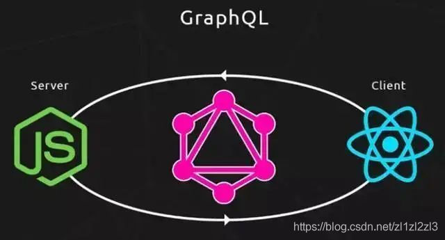
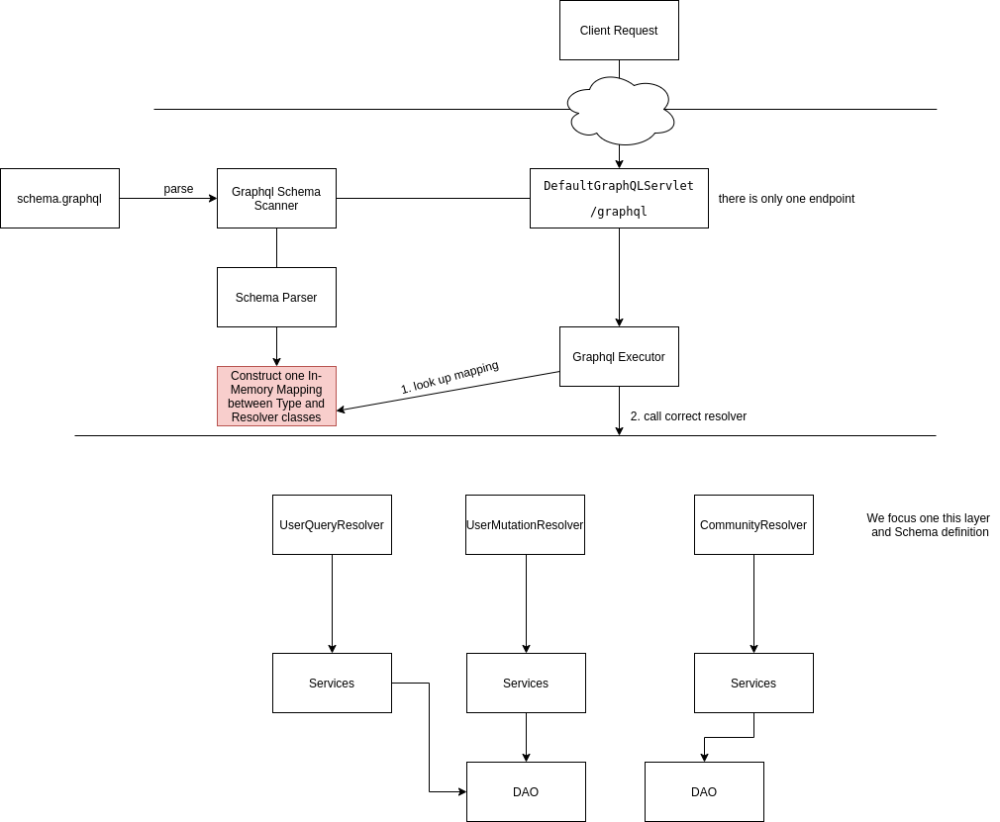
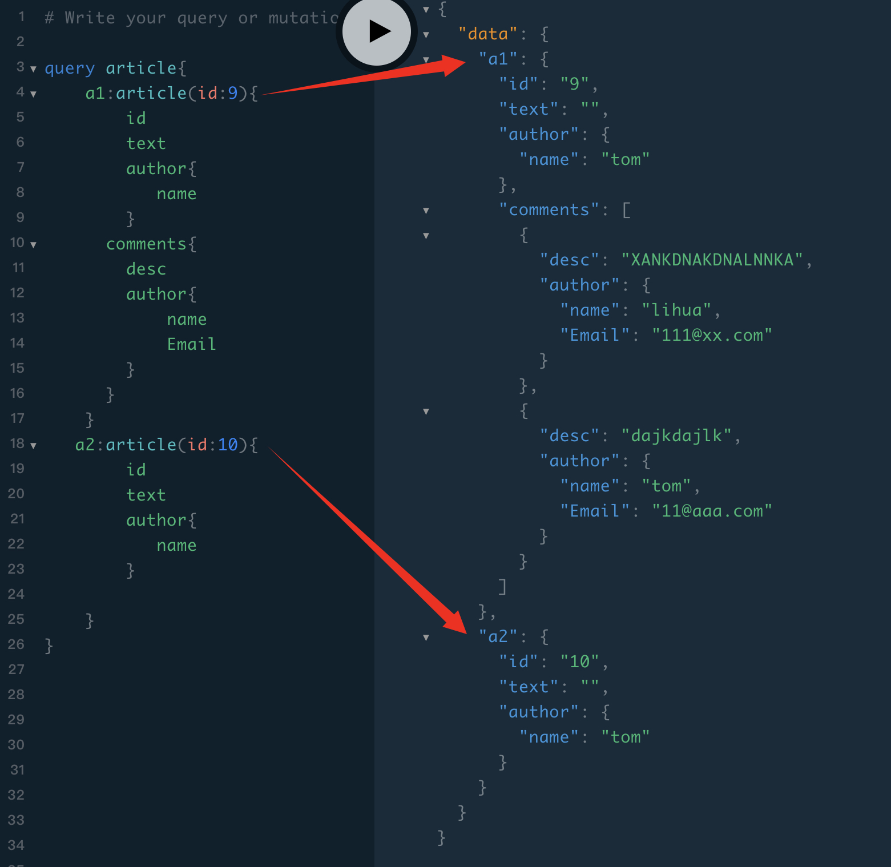
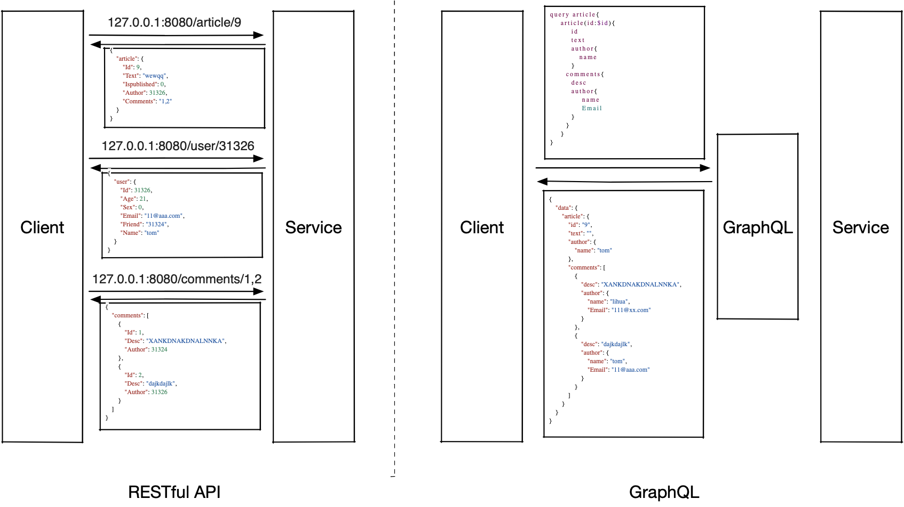
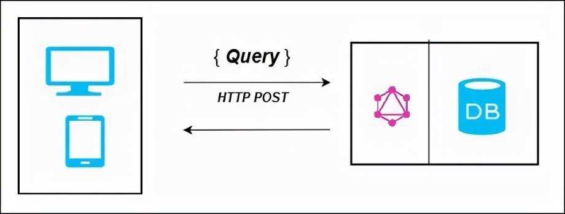
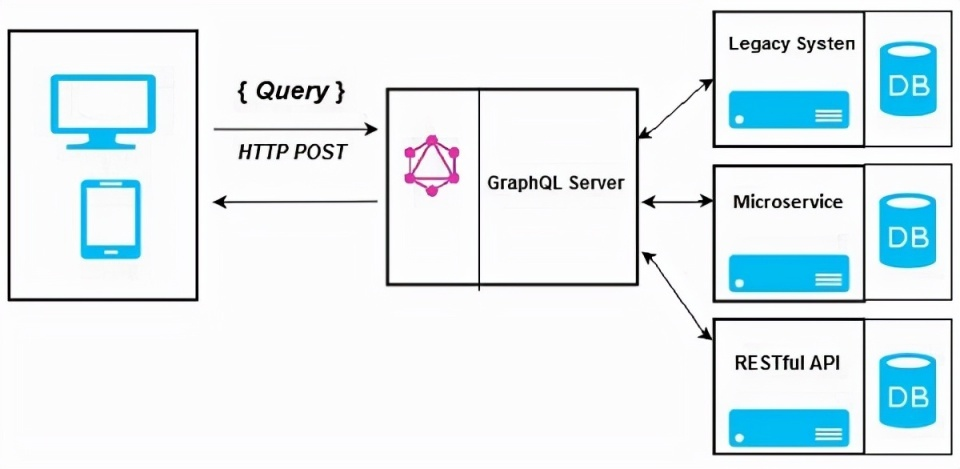
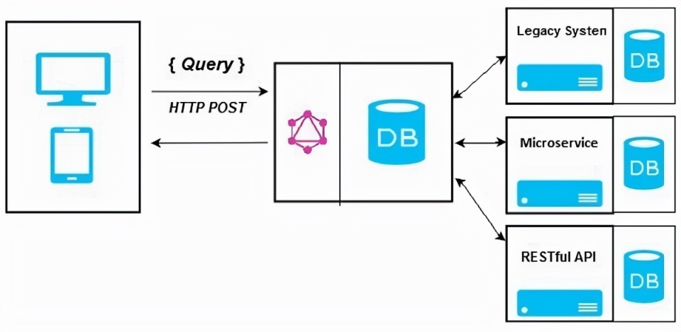

# Graphql
## 简介

* GraphQL是一种新的API标准，相较于RESTful 更加灵活、有效，降低了前后端沟通交流的成本。

* GraphQL本质上是一种基于API的数据查询语言，是基于API之上的一层封装。

  其工作模式为：

​		GraphQL是客户端和服务端进行通信的中介，通过对客户端请求的解析来调用服务端提供的服务。

GraphQL的核心思想是将应用层当数据库来用。

 

## GraphQL优点

​     简单设计博客上的一篇文章的数据模型如下：

~~~
type Article{ 
    id:ID!//id 自动生成
    text:String!//内容
    isPublished:Boolean!
    author:User!//作者
    comments:[Comment!]//评论
}

type User{
    id:ID!
    name:String!
    Email:String!
    Sex:String!
}

type Comment{
    id:ID!
    desc:String!
    author:User!
}
~~~

分别使用RESTful API和GraphQL来获取一篇文章的详细信息：

* Ask for what you need, get exactly that

  GraphQL通过声明式数据获取，将接口返回的数据交由前端控制，可根据需求精确获取数据，减少冗余数据的传输。同时可预测的返回结构，也提高了开发效率。

  

* 减少请求数量

  下图分别展示了使用RESTfule API和GraphQL获取一片文章详情的过程，可以看到使用RESTful API需要进行三次请求，而GraphQL只进行了一次请求。

  
  
  且与RESRful API不同，每一个GraphQL服务对外只提供一个用于调用内部接口的端点，所有的请求都访问该端点。

* 强类型约束

  GraphQL 是强类型的，查询基于字段及其关联的数据类型。如果 GraphQL 查询中存在类型不匹配，服务器应用程序会返回清晰且有用的错误消息。这有助于客户端应用顺利调试和轻松检测错误。 

## GraphQL 架构

可以使用下面列出的三种方法中的任何一种来部署 GraphQL Server：

- 带有连接数据库的 GraphQL 服务器
- 集成现有系统的 GraphQL 服务器
- 混合方法

### 带有连接数据库的 GraphQL 服务器

这种架构有一个带有集成数据库的 GraphQL 服务器，通常可以用于新项目。收到查询后，服务器读取请求有效负载并从数据库中获取数据。

在上图中，GraphQL 服务器和数据库集成在一个节点上。客户端（桌面/移动）通过 HTTP 与 GraphQL 服务器通信。服务器处理请求，从数据库中获取数据并将其返回给客户端。

### GraphQL 服务器集成现有系统

这种方法对于拥有遗留基础设施和不同 API 的公司很有帮助。GraphQL 可用于统一现有系统中的微服务、遗留基础设施和第三方 API。

在上图中，GraphQL API 充当客户端和现有系统之间的接口。客户端应用程序与 GraphQL 服务器通信，后者反过来解析查询。

### 混合方法
最后，我们可以将以上两种方式结合起来，搭建一个 GraphQL 服务器。在这种架构中，GraphQL 服务器将解析收到的任何请求。它将从连接的数据库或集成的 API 中检索数据。这如下图所示：

## 使用

基本语法：[GraphQL官网]( https://graphql.cn/learn/queries/#fields)

在GraphQL中，我们通过预先定义`Schema`对借口进行声明，也可以将该文件作为接口文档。

#### 对象的声明

一个Schema的最基础构成是对象类型，表示可以从service获取什么类型的对象，例如：

~~~
type Article{ 
    id:ID!//id 自动生成
    text:String!//内容
    isPublished:Boolean!
    author:User!//作者
    comments:[Comment!]//评论
}
~~~

id、text等都是字段的名称，String等是字段的类型，GraphQL提供了5种默认的标量类型：

* `Int`：有符号 32 位整数。
* `Float`：有符号双精度浮点值。
* `String`：UTF‐8 字符序列。
* `Boolean`：`true` 或者 `false`。
* `ID`：ID 标量类型表示一个唯一标识符，通常用以重新获取对象或者作为缓存中的键。ID 类型使用和 String 一样的方式序列化；然而将其定义为 ID 意味着并不需要人类可读型。

此外，还可以通过scalar自定义标量类型，如：

~~~
scalar Date
~~~

自定义的类型在Schema中仅作为表示，至于其实际发挥的作用取决于实现过程中的序列化、反序列化及验证方法。

同时，GraphQL提供了枚举类型，将字段的可选值限定于可选集合内。

GraphQL当前的类型修饰符有两种，分别是`List`和`Required`，它们的语法分别为`[Type]`和`Type!`

* []表示list
* ！表示被修饰的type不为空

例子：

~~~
myField:[String!]
~~~

可表示myField自身可以为空，但是不能有任何的空值成员。

~~~
myField: null // 有效
myField: [] // 有效
myField: ['a', 'b'] // 有效
myField: ['a', null, 'b'] // 错误
~~~

GraphQL中有两类特殊的对象Query和Mutation，分别表示对数据的请求和修改

~~~
type Query{
    articles:[Article!]!
    article(id:Int):Article!
    users:[User!]!
    user(id:Int):User!
    comments:[Comment!]!
    comment(id:Int):Comment!
}
type Mutation{
    createArticle(input:NewArticle!):Article!
    updateArticle(id:Int):Article!
    deleteArticle(id:Int):Article!

    createUser(input:NewUser!):User!
    updateUser(id:Int):User!
    deleteUser(id:Int):User!

    createComment(input:NewComment!):Comment!
    updateComment(id:Int):Comment!
    deleteComment(id:Int):Comment!
}
~~~

## 参考文献

1. [GraphQL 是 API 的未来，但它并非银弹](https://www.infoq.cn/article/iwfuokkbhwrljwegjy7y)
2. [GraphQL 设计思想](https://xie.infoq.cn/article/4c150b0bee8e4c95334ad2deb)
3. [30分钟理解GraphQL核心概念](https://juejin.cn/post/6844903586548154376#heading-5)
4. [restful 真out了，拥抱*GraphQL*](https://zhuanlan.zhihu.com/p/345659566)
5. [GraphQL 设计思想](https://xie.infoq.cn/article/4c150b0bee8e4c95334ad2deb)
6. [用接口的思想来理解GraphQL](https://juejin.cn/post/6844903647256526855)
7. [【从初学到放弃】*GraphQL*](https://zhuanlan.zhihu.com/p/109424841)
8. [代码之上：我们落地 *GraphQL* 背后的故事](https://zhuanlan.zhihu.com/p/141629697)
